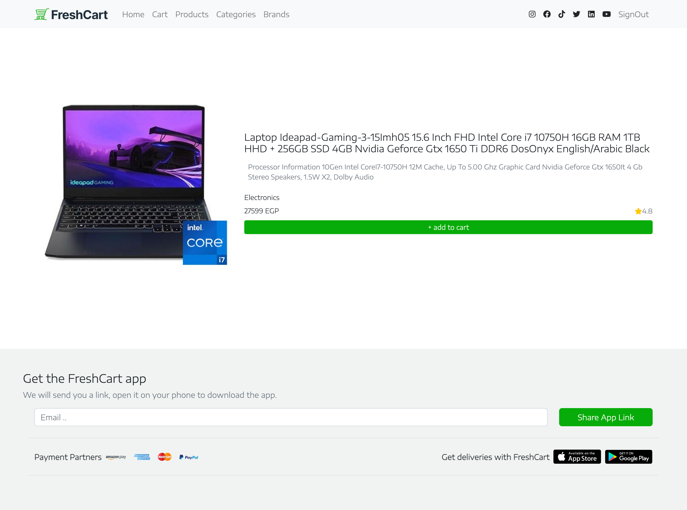

# 🥬 Fresh Market - Frontend App (React)

A modern, responsive frontend interface for an e-commerce platform, built with **React.js**.  
This project is the UI for browsing products, managing a cart, and simulating checkout — ideal for integration with any backend API.

---

## 🌍 Live Demo

🚀 Live on Vercel:  
👉 [https://fresh-market.vercel.app](https://fresh-market.vercel.app)

> 💡 Explore the UI and test its responsiveness on mobile and desktop.

---

## 🧰 Tech Stack

- ⚛️ **React.js** – Frontend library
- 🎨 **CSS / Tailwind / Styled-Components** (based on what you used)
- 🔁 **Axios / Fetch** – API integration (if any)
- 🧭 **React Router** – Client-side routing
- 🛒 Local State or Redux – (if used for cart)

---

## 📸 Screenshots

> 📷 Add screenshots or GIFs here for homepage, product list, cart, etc.

```md


